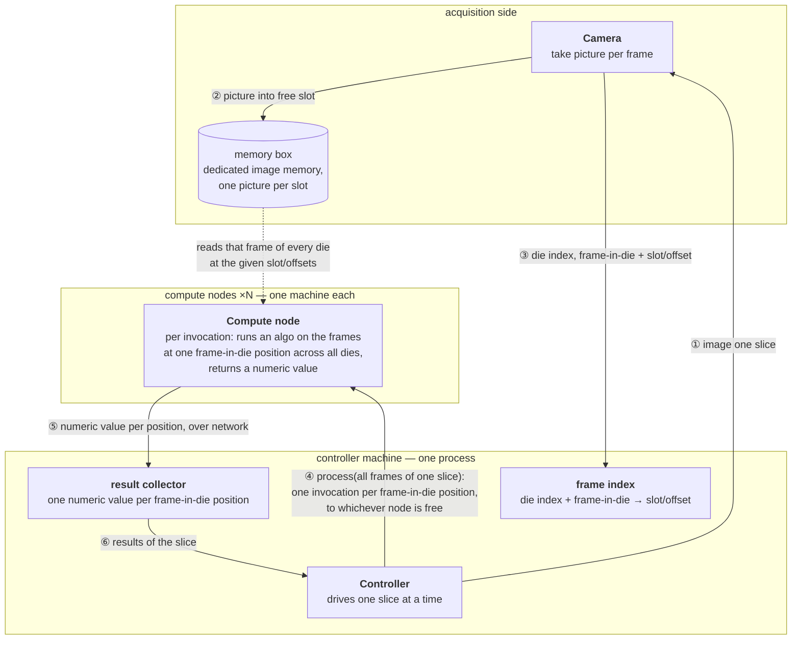
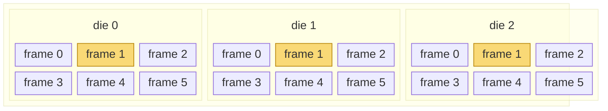

# Algorithm Controller

Design for the interview question: *"Our tool photographs a wafer slice by slice — [a slice is a
strip of dies, and each die is captured as several frames](#slice-anatomy). Every picture lands in
one slot of a shared memory box, and from then on a frame is named by its slot/offset, never
copied. Design the controller that, one slice at a time, splits the slice's work across a group of
compute nodes; each invocation runs an algorithm on all the frames that share one frame-in-die
position (i.e. the same frame position in every die) and returns a single numeric value; the
controller then gathers those values: one per frame-in-die position, so [dies of six
frames](#slice-diagram) yield six values for the slice."*

## Requirements

- The wafer is imaged **slice by slice**; a slice contains dies, and each die is imaged as
  multiple **frames**.
- Taking a picture writes it into the **memory box**: each slot holds exactly one picture, and a
  frame is referenced by its **slot/offset** from then on — pixels are never copied around.
- The imaging side reports back which picture belongs where: **die index + frame-in-die**, mapped
  to the slot/offset that holds it.
- The controller processes **all frames of one slice** as a unit before moving to the next slice.
- A set of **compute nodes** — separate machines — does the work. The unit of work is one
  invocation: **run an algorithm on all frames that share one frame-in-die position** (i.e. the
  same frame position in every die of the slice) and return a **single numeric value** for that
  position. Any node can serve any invocation. Every die is a copy of the same circuit, so one
  frame-in-die position is the same physical region in every die — the natural input set for
  comparing that region across dies.
- The controller collects one numeric value per frame-in-die position — that set of values is the
  output of processing a slice.

## Architecture

**Solution overview.** The system spans several machines: the controller is one process on its own
machine, each compute node is a separate machine, and between them sits the memory box — a
dedicated bank of picture-sized memory slots that every node can read in parallel over a fast
link, without going through a filesystem or the controller. The controller works one slice at a
time. It asks the camera to photograph the slice①; each picture is written into a free
slot of the memory box②, and the controller records which die and frame-in-die each
slot holds③. It then orders processing of all frames of the slice④: one
invocation per frame-in-die position, carrying the slot/offsets of that frame in every die, sent
to whichever node is free next — so a slow position ties up one machine, not the slice. The node
pulls those frames straight out of the memory box, runs the algorithm across them — every die is
a copy of the same circuit, so the input set is one physical region seen once per die — and
returns one number for the position⑤. The controller gathers a value per
position⑥ and moves on to the next slice. Pixels cross the wire once — from the memory
box to the one node that processes them; everything else on the network is small messages.

## Slice anatomy

How a slice decomposes — the outer box is one slice, a strip of dies, and each die is imaged as a
grid of frames. The highlighted frames share one frame-in-die position (frame 1 of every die):
together they are the input set of a single invocation, which returns one numeric value for that
position.

### Slice diagram

