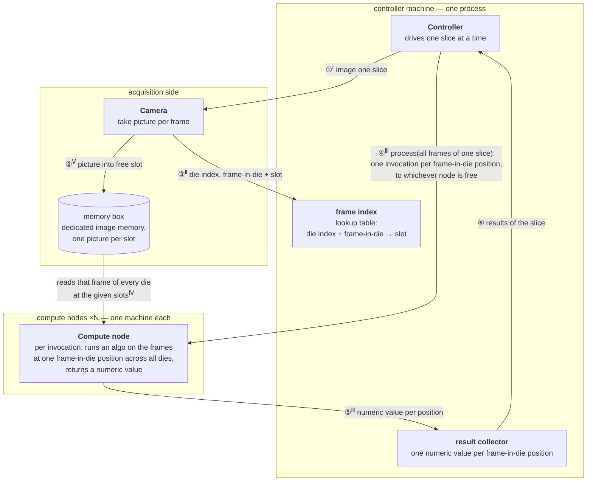
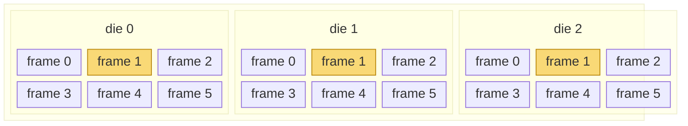

# Algorithm Controller

Design of a controller that fans one wafer slice's frames out to a group of compute nodes and
gathers one numeric value per frame-in-die position.

[Problem statement](#problem-statement) · [Derived requirements](#derived-requirements) ·
[Solution overview](#solution-overview) · [Architecture](#architecture) ·
[Component APIs](#component-apis) · [Appendix: slice anatomy](#appendix-slice-anatomy)

## Problem statement

*"Our tool photographs a wafer slice by slice — [a slice is a
strip of dies, and each die is captured as several frames](#appendix-slice-anatomy). Every picture
lands in one slot (AKA offset) of a shared memory box, and from then on a frame is named by its slot,
never copied. Design the controller that, one slice at a time, splits the slice's work across a
group of compute nodes; each invocation runs an algorithm on all the frames that share one
frame-in-die position (i.e. the same frame position in every die) and returns a single numeric
value; the controller then gathers those values: one per frame-in-die position, so [dies of six
frames](#slice-diagram) yield six values for the slice."*

## Derived requirements

- As each picture lands, the acquisition side reports its placement to the controller: which
  **die index + frame-in-die** it captures, and the slot that holds it.
- The **compute nodes are separate machines**, and any node can serve any invocation.
- Every die is a copy of the same circuit, so one frame-in-die position is the same physical
  region in every die — the natural input set for comparing that region across dies.

## Solution overview

The system spans several machines: the controller is one process on its own
machine, each compute node is a separate machine, and between them sits the memory box — a
dedicated bank of picture-sized memory slots that every node can read in parallel over a fast
link, without going through a filesystem or the controller. The controller works one slice at a
time. It asks the camera to photograph the slice<sup>①</sup>; each picture is written into a free
slot of the memory box<sup>②</sup>, and the controller records which die and frame-in-die each
slot holds<sup>③</sup> in its frame index — a lookup table from die index + frame-in-die to
slot. It then orders processing of all frames of the slice<sup>④</sup>: one
invocation per frame-in-die position, carrying the slots of that frame in every die, sent
to whichever node is free next — so a slow position ties up one machine, not the slice. The node
pulls those frames straight out of the memory box, runs the algorithm across them — every die is
a copy of the same circuit, so the input set is one physical region seen once per die — and
returns one number for the position<sup>⑤</sup>. The controller gathers a value per
position<sup>⑥</sup> and moves on to the next slice. Pixels cross the wire once — from the memory
box to the one node that processes them; everything else on the network is small messages.

## Architecture

The controller is at the top — commands flow downward (① imaging, ④ invocations), data and
results flow back up (③ placements, ⑤ values).



## Component APIs

Each numbered arrow in the diagram is one call below, and carries a superscript roman numeral
(①<sup>Ⅰ</sup>) naming the interface — the code block of the same numeral — it belongs to. Every
cross-machine call carries only identifiers and numbers; pixels move solely through memory-box
reads. Step ⑥ has no API — the result collector and the controller share one process.

All interfaces share this vocabulary:

```cpp
using SliceId    = std::uint64_t;
using DieIndex   = std::uint32_t;
using FrameInDie = std::uint32_t; // frame position within a die — the same region in every die
using SlotOffset = std::uint64_t; // addresses one picture-sized slot of the memory box
```

### <sup>Ⅰ</sup> Controller → camera (①)

```cpp
// Starts imaging one slice. Returns immediately; per-frame placements (③) and the
// completion signal arrive as callbacks while pictures land in the memory box (②).
void image_slice(SliceId slice);
```

### <sup>Ⅱ</sup> Camera → controller (③)

```cpp
// One call per stored picture — adds the frame-index entry (die, frame) → slot.
void on_frame_stored(SliceId slice, DieIndex die, FrameInDie frame, SlotOffset slot);

// Every frame of the slice is in the memory box; the controller may start dispatching.
void on_slice_imaged(SliceId slice);
```

### <sup>Ⅲ</sup> Controller → compute node (④), reply (⑤)

```cpp
// One invocation, sent to whichever node is free: run the algorithm on the frames at one
// frame-in-die position. `slots` lists the position's slot number for each die, in die order,
// resolved via the frame index. The span views only this list of numbers — the slots it names
// may lie anywhere in the memory box. The reply (⑤) is the single numeric value for that position.
double process_position(SliceId slice, FrameInDie position,
                        std::span<const SlotOffset> slots);
```

**From lookup table to invocation.** Once every placement (③) is in, the frame index is a
completed table of (die index, frame-in-die) → slot. The controller reads it one position at a
time: for position `p` it walks the dies in order, looks up each die's slot for `p`, and
`push_back` appends that slot to the end of a `std::vector<SlotOffset>` — the vector starts empty
and grows by one entry per die. Traced for position 1 of a three-die slice whose frame index
holds (die 0, pos 1) → 9, (die 1, pos 1) → 5, (die 2, pos 1) → 106:

```cpp
std::vector<SlotOffset> slots;                          // starts empty: {}
for (DieIndex die = 0; die < die_count; ++die)
    slots.push_back(frame_index.at({die, position}));   // appends that die's slot at the end
// die 0: at({0, 1}) returns   9 → slots is {9}
// die 1: at({1, 1}) returns   5 → slots is {9, 5}
// die 2: at({2, 1}) returns 106 → slots is {9, 5, 106}

process_position(slice, position, slots);               // sends {9, 5, 106} as a span
```

`std::span` can only view a contiguous sequence, and `std::vector` guarantees contiguous element
storage by the standard — that pairing is what makes the implicit conversion safe. The contiguity
applies to the list of slot numbers only; the slots those numbers name are scattered across the
memory box wherever `write_picture` (Ⅴ) found room:

```
controller's vector:   [ 9, 5, 106 ]          <- contiguous, the span views this
                         │  │   │
memory box:     slot 9 ──┘  │   └───── slot 106
                (die 0)   slot 5       (die 2)
                          (die 1)
```

The span itself never crosses the wire — it is a local pointer + length, meaningless on another
machine. The RPC layer serializes the vector's few `uint64_t` values into the request; the node's
stub deserializes them into its own contiguous buffer and presents a fresh span to the handler,
which then pulls the actual pixels slot by slot via `read_frame` (Ⅳ).

### <sup>Ⅳ</sup> Compute node → memory box (dotted read)

```cpp
// Maps one slot for reading. The view aliases memory-box storage — pixels are not copied.
std::span<const std::byte> read_frame(SlotOffset slot);
```

### <sup>Ⅴ</sup> Camera → memory box (②), slot recycling

```cpp
// Stores one picture into a free slot and returns which slot was chosen —
// the camera then reports that slot to the controller (③).
SlotOffset write_picture(std::span<const std::byte> pixels);

// Called by the controller once a slice's results are gathered (⑥), so its
// slots can hold the next slice's pictures.
void release_slots(std::span<const SlotOffset> slots);
```

## Appendix: slice anatomy

How a slice decomposes — the outer box is one slice, a strip of dies, and each die is imaged as a
grid of frames. The highlighted frames share one frame-in-die position (frame 1 of every die):
together they are the input set of a single invocation, which returns one numeric value for that
position.

### Slice diagram


