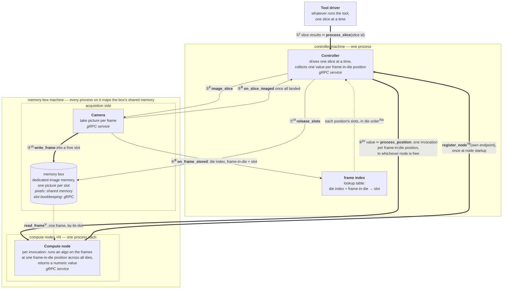
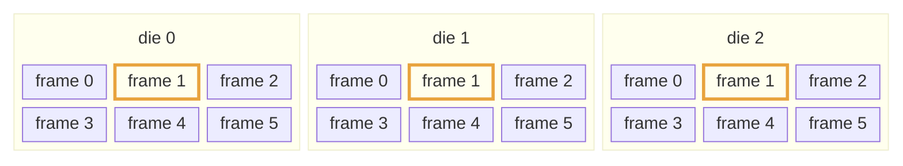

# Algorithm Controller

[](https://github.com/erancha/algorithm-controller/actions/workflows/ci.yml)

Design of a wafer-inspection tool's controller: each [`process_slice`](#architecture) call farms
a slice's frame-in-die positions out to a group of compute nodes and gathers one numeric value
per position.

**Contents:** [Getting started](#getting-started) · [Problem statement](#problem-statement) ·
[Terminology](#terminology) · [Derived requirements](#derived-requirements) ·
[Solution overview](#solution-overview) · [Architecture](#architecture) ·
[Component APIs](#component-apis) · [Implementation](docs/implementation/README.md) ·
[Appendix: slice anatomy](#appendix-slice-anatomy) · [License](#license)

## Getting started

Requires a Linux shell, CMake ≥ 3.25, a C++20 compiler, and a
[vcpkg](https://github.com/microsoft/vcpkg) checkout (gRPC, Protobuf, and GoogleTest come from its
manifest):

```bash
export VCPKG_ROOT=~/vcpkg     # your vcpkg checkout; the first configure compiles gRPC and
                              # protobuf from source (several minutes, once)
./scripts/start.sh generate   # one-time: build and render the fixture images
./scripts/start.sh            # start the whole stack, run one slice, tear down
./scripts/test.sh             # build and run the test suite (unit, service, e2e)
```

[Implementation](docs/implementation/README.md) covers what a run simulates and its timing knobs,
the process topology, and the memory footprint.

## Problem statement

*"Design the controller of a wafer-inspection tool that photographs a wafer slice by slice —
[a slice is a strip of dies, and each die is captured as several frames](#appendix-slice-anatomy).
Every picture lands in one slot (AKA offset) of a shared memory box, and from then on a frame is
named by its slot, never copied. The controller, one slice at a time, splits the slice's work
across a group of compute nodes; each invocation runs an algorithm on all the frames that share
one frame-in-die position (i.e. the same frame position in every die) and returns a single
numeric value; the controller then gathers those values: one per frame-in-die position, so
[dies of six frames](#one-slice-diagram) yield six values for the slice."*

## Terminology

- **die** — one copy of the chip's circuit; a wafer carries many identical dies.
- **slice** — a strip of dies.
- **frame** — one camera picture covering part of a die; a die is too large for one shot, so
  each die is imaged as a [grid of frames](#one-slice-diagram).
- **frame-in-die position** — a frame's place in that grid.
- **slot** — one picture-sized cell of the shared memory box, identified by its numeric offset
  into the box (hence AKA "offset").

## Derived requirements

- As each picture lands, the acquisition side reports its placement to the controller: which
  **die index + frame-in-die** it captures, and the slot that holds it.
- The **compute nodes are separate processes** on the memory-box machine, and any node can
  serve any invocation.
- Dies are copies of one circuit, so a frame-in-die position is the same physical region in
  every die — the natural input set for cross-die comparison.

## Solution overview

The controller is one process on its own machine; each compute node is a separate process on the
memory-box machine; between them sits the memory box — a bank of picture-sized slots that every node
reads in parallel through shared memory, bypassing filesystem and controller. 

**Flow**
- Each call to [`process_slice`](#architecture) <sup>①</sup> hands the controller one slice and returns its results;
- The controller asks the camera to photograph the slice: [`image_slice`](#architecture)<sup>②</sup>; 
- Each picture lands in a free slot<sup>③</sup>, and the controller records which die and frame-in-die each slot holds<sup>④</sup> in its frame index. 
- Once the camera reports the slice fully imaged: [`on_slice_imaged`](#architecture)<sup>⑤</sup>:
    - The controller dispatches one invocation per frame-in-die position<sup>⑥</sup> — carrying that frame's slots, 
      one per die — to whichever compute node is free. 
    - The node pulls those frames straight from the memory box, runs the algorithm across them, 
      and returns one number for the position as ⑥'s reply; 
    - The controller writes each reply into the results vector at its position index. 
      It returns that vector as ①'s reply, then releases the slice's slots<sup>⑦</sup> for the next slice's pictures. 
- Note: Pixels never cross the wire — each node maps the memory box and reads frames in place; everything on the network is small messages.

**Compute nodes registration**: The controller is never configured with node addresses. Each compute node announces its own
endpoint to the controller once at startup<sup>Ⅶ</sup>; the dispatch pool is simply the set of
nodes that have registered so far, so nodes can be added by just starting them. The inverse also
holds: a node whose invocation fails or times out is dropped from the pool, so one dead node
costs at most the slice in flight — never every slice after it — and returns by re-registering.

**Whole-slice dispatch**: Dispatch deliberately waits for the whole slice before the first invocation. A streaming
refinement — dispatching each position as soon as its frame has landed in every die — is
sketched in [streaming dispatch](docs/streaming-dispatch.md) and kept out of this design.

## Architecture

Arrow shape encodes call semantics: **thick** — synchronous request/reply; **thin** — one-way
asynchronous message; **dotted** — data flow, not a command. Solid arrows travel over gRPC, with
one carve-out: ③'s pixel payload lands in the memory box through shared memory — only its slot
bookkeeping is a gRPC call — and the dotted read (Ⅴ) is pure shared memory, so pixels never
cross gRPC.



## Component APIs

Two numberings tie the diagram to the code: circled numbers (①–⑦) are the chronological steps,
one per solid arrow; superscript roman numerals name the code blocks below. So ①<sup>Ⅰ</sup>
reads "step 1, defined in block Ⅰ" — and the arrow's **bold** function heads that block under
the same name. A leading `x ⇐` names the call's return value. Dotted arrows carry data, not
steps: the memory-box read is block Ⅴ, pulled by a node while serving ⑥, and the frame-index →
controller hop composes each ⑥ invocation's slot list — block Ⅳa,
[from lookup table to invocation](#ⅳa-from-lookup-table-to-invocation). One solid arrow also
carries no step number: registration (Ⅶ) happens once per node at startup, before any slice
exists, so it sits outside the ①–⑦ cycle. Every cross-machine call carries only identifiers
and numbers, and every call carries a deadline — a stalled peer surfaces as an error, never as
a hang. Pixels move solely through memory-box reads.

Shared vocabulary — [slice anatomy](#appendix-slice-anatomy) visualizes slices, dies and frames:

```cpp
using SliceId    = std::uint64_t;
using DieIndex   = std::uint32_t;
using FrameInDie = std::uint32_t; // frame position within a die — the same region in every die
using SlotOffset = std::uint64_t; // names one picture-sized slot by its offset in the memory box
```

### <sup>Ⅰ</sup> Tool driver → controller (①)

```cpp
// Public entry point of the controller — one call runs one slice end to end: images it (②),
// dispatches one node invocation per frame-in-die position (⑥), and returns the gathered
// results — element i is the value for frame-in-die position i.
std::vector<double> process_slice(SliceId slice);
```

### <sup>Ⅱ</sup> Controller → camera (②)

```cpp
// Starts imaging one slice. Returns immediately; per-frame placements (④) and the
// completion signal (⑤) arrive as callbacks while pictures land in the memory box (③).
void image_slice(SliceId slice);
```

### <sup>Ⅲ</sup> Camera → controller (④, ⑤)

```cpp
// One call per stored picture — adds the frame-index entry (die, frame) → slot.
void on_frame_stored(SliceId slice, DieIndex die, FrameInDie frame, SlotOffset slot);

// Every frame of the slice is in the memory box; the controller may start dispatching (⑥).
void on_slice_imaged(SliceId slice);
```

### <sup>Ⅳ</sup> Controller → compute node (⑥)

```cpp
// One invocation, sent to whichever node is free: run the algorithm on the frames at one
// frame-in-die position — process_slice (Ⅰ) issues one such call per position. `slots` lists
// the position's slot number for each die, in die order, resolved via the frame index. The
// span views only this list of numbers — the slots it names may lie anywhere in the memory
// box. The reply is the single numeric value for that position; the controller keeps one
// invocation in flight on every free node and writes each reply into the results vector
// at its position index.
double process_position(SliceId slice, FrameInDie position,
                        std::span<const SlotOffset> slots);
```

#### <sup>Ⅳa</sup> From lookup table to invocation

Once every placement (④) is in, the frame index is a completed table of
(die index, frame-in-die) → slot. For position `p` the controller walks the
dies in order, appending each die's slot to a `std::vector<SlotOffset>`. Traced for position 1
of a three-die slice whose frame index holds (die 0, pos 1) → 9, (die 1, pos 1) → 5,
(die 2, pos 1) → 106:

```cpp
std::vector<SlotOffset> slots;                          // starts empty: {}
for (DieIndex die = 0; die < die_count; ++die)
    slots.push_back(frame_index.at({die, position}));   // appends that die's slot at the end
// die 0: at({0, 1}) returns   9 → slots is {9}
// die 1: at({1, 1}) returns   5 → slots is {9, 5}
// die 2: at({2, 1}) returns 106 → slots is {9, 5, 106}

process_position(slice, position, slots);               // sends {9, 5, 106} as a span
```

`std::span` can only view a contiguous sequence, and `std::vector` guarantees contiguous element
storage by the standard — that pairing is what makes the implicit conversion safe. The contiguity
applies to the list of slot numbers only; the slots those numbers name are scattered across the
memory box wherever `write_frame` (Ⅵ) found room:

```
controller's vector:   [ 9, 5, 106 ]          <- contiguous, the span views this
                         │  │   │
memory box:     slot 9 ──┘  │   └───── slot 106
                (die 0)   slot 5       (die 2)
                          (die 1)
```

The span itself never crosses the wire — it is a local pointer + length, meaningless on another
machine. The RPC layer serializes the vector's few `uint64_t` values into the request; the node's
stub deserializes them into its own contiguous buffer and presents a fresh span to the handler,
which then pulls the actual pixels slot by slot via `read_frame` (Ⅴ).

### <sup>Ⅴ</sup> Compute node → memory box (dotted read)

```cpp
// Maps the slot at the given offset for reading — a node calls it once per die while
// serving ⑥. The view aliases memory-box storage; pixels are not copied.
std::span<const std::byte> read_frame(SlotOffset slot);
```

### <sup>Ⅵ</sup> Camera → memory box (③), controller → memory box (⑦)

```cpp
// Stores one picture into a free slot and returns which slot was chosen —
// the camera then reports that slot to the controller (④).
SlotOffset write_frame(std::span<const std::byte> pixels);

// Called by the controller once a slice's results are gathered, so its
// slots can hold the next slice's pictures.
void release_slots(std::span<const SlotOffset> slots);
```

### <sup>Ⅶ</sup> Compute node → controller (registration)

```cpp
// Announces this node to the controller, once at node startup: endpoint is the address the
// controller dials back for process_position (⑥) invocations. Registering the same endpoint
// again replaces its connection (a restarted node) rather than growing the pool. Returns once
// the controller has recorded the node, so a successfully started node is dispatchable.
// The controller drops a node whose ⑥ invocation fails or times out; registering again is
// also how such a node rejoins.
void register_node(const std::string& endpoint);
```

## Appendix: slice anatomy

An example slice: three dies, each imaged as six frames. Every frame-in-die position groups one
frame from each die into the input set of a single invocation, which returns one value for that
position — the highlight shows one such group, frame 1 of every die. Six positions, so this
slice's [`process_slice`](#ⅰ-tool-driver--controller-①) reply holds six values.

The diagram is a miniature. At a realistic scale, a 4096×4096 8-bit sensor makes each frame
16 MB; with a 2 mm field of view a 10 mm die is a 5×5 grid of 25 frames, and a 20-die slice
fills ~8 GB of the memory box — the load that motivates dedicated image memory and pixels
crossing the wire only once.

### One slice diagram



## License

Released under the MIT License. See [LICENSE](LICENSE).

---

More projects by the author: [github.com/erancha](https://github.com/erancha)
