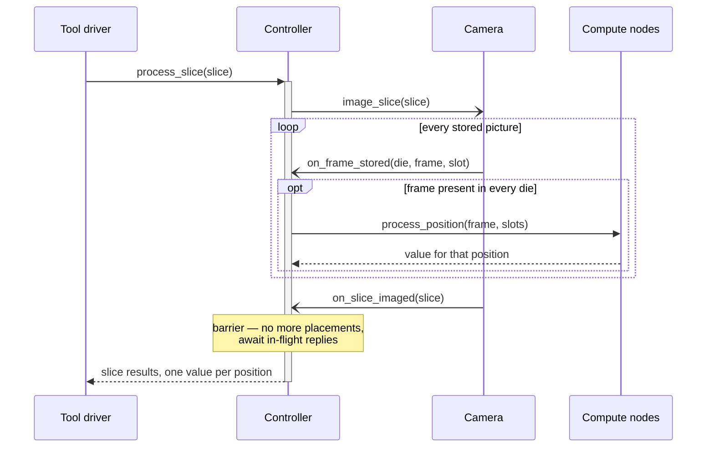

# Streaming dispatch

**OPEN — not part of the current design.** The [main design](../README.md) dispatches a slice's
invocations only after `on_slice_imaged`, keeping acquisition and compute strictly sequential per
slice. This sketch overlaps them; it is recorded here so the main README can stay at one level of
detail.

## Idea

A frame-in-die position is dispatchable as soon as its frame has landed in *every* die — which can
be long before the whole slice is imaged. The frame index tracks a per-position counter of dies
reported via `on_frame_stored`; when a position's counter reaches the die count, the controller
fires `process_position` for it immediately. Compute nodes then work while the camera is still
acquiring the rest of the slice.

No interface changes: the same calls fire in a different order. `on_slice_imaged` shifts roles
from dispatch gate to completion barrier — it tells the controller no more placements are coming,
so "all dispatched positions have replied" then means "slice complete", and a lost frame surfaces
as a position that never becomes dispatchable rather than a silent hang.

## Timing

Arrowheads follow mermaid's sequence-diagram convention: filled head = synchronous call,
open head = asynchronous message, dashed = reply.

## Expected gain, and its limit

The overlap harvested depends entirely on the camera's scan order. If the camera finishes die 0,
then die 1, and so on, every position completes only when the last die is scanned — near-zero
gain. If it rasters across the strip (the same frame row of every die before the next row),
positions complete steadily throughout acquisition and most compute hides behind imaging.
Per-position readiness tracking costs one counter per position either way, so it is a safe
default rather than a bet on scan order.

## Follow-on: per-position slot release

Once values stream in per position, `release_slots` can also fire per position instead of per
slice, cutting peak memory-box occupancy and letting the next slice's imaging start before this
slice's last computations drain. That abandons the "one slice at a time" simplification of the
main design, so it belongs to this sketch, not the README.
